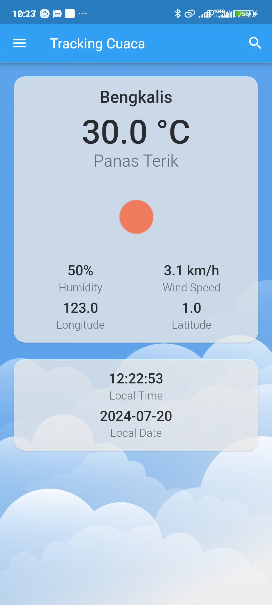
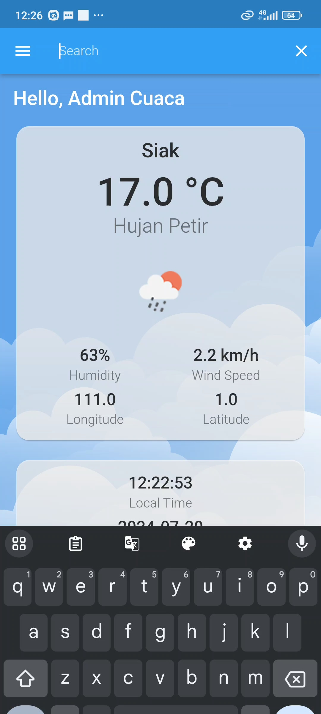
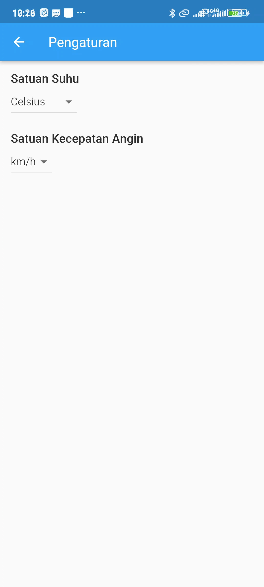

# Aplikasi Cuaca Flutter + PHP Backend

Aplikasi cuaca modern yang dibangun dengan Flutter dan mengambil data cuaca melalui API backend PHP. Ini merupakan proyek kecil untuk menyelesaikan matakulia Pemrograman Multiplatform

## Fitur Utama

- Informasi cuaca
- Data cuaca berdasarkan lokasi
- Pencarian cuaca berdasarkan nama kota
- Metrik cuaca detail (suhu, kelembaban, kecepatan angin, dll.)
- Desain UI responsif dan modern

## Screenshot Aplikasi

| Halaman Utama               | Pencarian Kota               | Pengaturan                       | Pengembang                   |
|-----------------------------|------------------------------|----------------------------------|------------------------------|
|     |  |  |  |

## Tech Stack

### Frontend (Mobile App)
- Flutter SDK
- Bahasa pemrograman Dart
- Provider state management
- Package HTTP untuk panggilan API

### Backend
- PHP 7.4+
- Database MySQL 
- Arsitektur RESTful API Postman

## Instalasi

1. Clone repository
```bash
git clone https://github.com/zizfiq/cuaca.git
```

2. Masuk ke direktori backend
```bash
cd cuaca
```

3. Install dependensi
```bash
flutter pub get
```

4. Jalankan aplikasi
```bash
flutter run
```

## Endpoint API

- `GET /api/read_cuaca.php` - Mendapatkan cuaca saat ini
- `GET /api/read_cuaca.php?id=20` - Mencari cuaca berdasarkan kota
- `POST /api/update_cuaca.php` - Menyimpan informasi cuaca


## Lisensi

Proyek ini dilisensikan di bawah Lisensi MIT - lihat file [LICENSE](LICENSE) untuk detail
